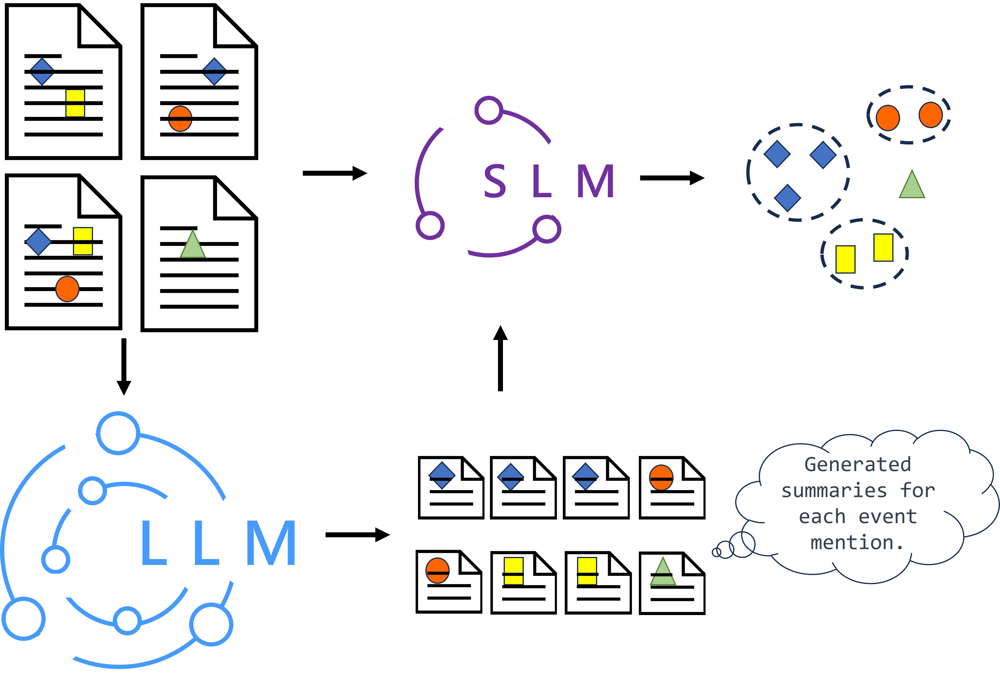

# SECURE
This is the implementation of the ACL 2024 Main paper: [**S**ynergetic **E**vent Understanding: A **C**ollaborative Approach to Cross-Doc**u**ment Event Coreference **Re**solution with Large Language Models](https://arxiv.org/abs/2406.02148).

This codebase builds upon the implementation from [Focus on what matters: Applying Discourse Coherence Theory to Cross Document Coreference](https://github.com/Helw150/event_entity_coref_ecb_plus), with further enhancements and modifications.

## Codebase Release Progress

**⚠️ Important Update ⚠️**  
A bug related to the `neighbor_size` parameter during training has been **fixed**, so if you have already **forked** or **cloned** the repository, please pull the latest changes to ensure optimal performance.  


We are gradually releasing materials related to our paper. The release includes the following:

- [x] Code for data preparation on ECB+
- [x] Code for model training and evaluation on ECB+
- [ ] Code for LLM summary generation on ECB+
- [ ] Trained checkpoints on ECB+
- [ ] Original and generated data on ECB+
- [ ] The same steps above apply to GVC and FCC as well

Beyond our initial release, we are also planning to release the following;
however, they are subject to change (in terms of the release date and the content):

- [ ] Migrations of backbond model from RoBERTa to Longformer/CDLM

## Quick links

* [Overview](#overview)
* [Preparation](#preparation)
  * [Environment](#environment)
  * [Data](#data)
* [Run the model](#run)
  * [Model training](#model-training)
  * [Model testing](#model-tesing)
* [Citation](#citation)

## Overview


In this work we present SECURE: a collaborative approach for cross-document event coreference resolution, leveraging the capabilities of both a
universally capable LLM and a task-specific
SLM. We formulate our contribution as follow.

1. We design generic tasks to leverage the potential
of LLMs for CDECR, effectively bridging the gap
between the general capabilities of LLMs and the
complex annotation guidelines of specific IE tasks. 
2. We focus on processing each mention individually, which is more efficient compared to existing methods that require handling combinations of mention pairs, resulting in a quadratic increase in processing entries.


## Preparation

### Environment
To run our code, please first ensure you have Python installed. This codebase is tested with Python version 3.10.13. We recommend using [Conda](https://docs.anaconda.com/anaconda/) for managing your Python environment: 
```
conda create -n secure python=3.10.13
conda activate secure
```

To install all the dependency packages by using the following command:

```
pip install -r requirements.txt
```

For the usage of spacy, the following command could be helpful:
```
python -m spacy download en_core_web_sm
```

### Data
We conduct experiments on three common datasets: ECB+, GVC and FCC. You can use our provided preprocessed data or construct the datasets from scratch yourself.
- ECB+: run the following command to construct the datasets:

```bash
bash ./data/download_dataset.sh
```  

## Run the model
We use the lightweight tool [**MLrunner**](https://github.com/simtony/mlrunner) to run our experiments.
### Model training
 You can simply train SECURE with following commands:
```bash
run -y configs/candidate_generation_train.yaml -o exps/candidate_generation
run -y configs/pairwise_classification_train.yaml -o exps/pairwise_classification
```
Folders will be created automatically to store models and logs:
1. ```exps/candidate_generation```: In the first stage, candidate coreferring mentions are
 retrieved from a neighborhood surrounding a particular mention. These candidate pairs are fed to the second stage of pairwise classifier. 
2. ```exps/pairwise_classification```: In the second stage, a transformer with cross-attention between
 pairs is used for binary classification.

You can see hyperparameter settings in ```configs/candidate_generation_train.yaml``` and ```configs/pairwise_classification_train.yaml```.

```model_type```: 'base' for baseline, 'secure' for our model
```summary_type```: Only used in 'secure' model_type. 'elaboration-entityCoref_date' for the full steps of our summary. 'elaboration' for the first step of our summary. 'paraphrase' for the ablation of our summary.
```dataset_type```: 'ecb+' for the ECB+ dataset.

### Model testing
 You can test SECURE with following commands:
```bash
run -y configs/candidate_generation_eval.yaml -o exps/candidate_generation
run -y configs/pairwise_classification_eval.yaml -o exps/pairwise_classification
```
 We are uploading the trained models and will share the links later.

## Citation
Please cite our paper if you use SECURE in your work:
```bibtex
@inproceedings{min-etal-2024-synergetic,
    title = "Synergetic Event Understanding: A Collaborative Approach to Cross-Document Event Coreference Resolution with Large Language Models",
    author = "Min, Qingkai  and
      Guo, Qipeng  and
      Hu, Xiangkun  and
      Huang, Songfang  and
      Zhang, Zheng  and
      Zhang, Yue",
      Martins, Andre  and
      Srikumar, Vivek",
    booktitle = "Proceedings of the 62nd Annual Meeting of the Association for Computational Linguistics (Volume 1: Long Papers)",
    month = aug,
    year = "2024",
    address = "Bangkok, Thailand",
    publisher = "Association for Computational Linguistics",
    url = "https://aclanthology.org/2024.acl-long.164",
    doi = "10.18653/v1/2024.acl-long.164",
    pages = "2985--3002",
}
```
